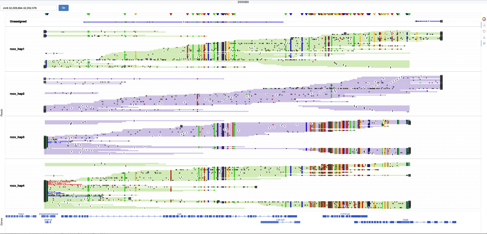

# Orographer

**Orographer is in a pre-release status for feedback only. It is currently intended only for use with [paraviewr](https://github.com/PacificBiosciences/Paraviewer)**

## Interactive alignment plots from BAM and coordinates

Orographer reads a BAM file and one or more genomic regions, then generates interactive Bokeh-based HTML plots for reviewing alignments. It supports optional GTF/GFF3 gene tracks and VCF variant overlay. Currently orogapher only supports enhanced visualizations for [paraviewer](https://github.com/PacificBiosciences/Paraviewer).

### Overview

Orographer can be installed from source and run on Mac or Linux. It requires a BAM file, reference FASTA, and coordinate(s) in `chrom:start-end` format. Output is a single-page HTML app with JSON data, suitable for deployment behind a simple HTTP server.

For details, see [User Guide](docs/user_guide.md).

Plots include:

- Read alignments as arrows with haplotype grouping and strand coloring
- Optional gene track from a bgzip-indexed GTF or GFF3 file
- Optional VCF variant track
- Coordinate navigation (pan, zoom, and a “Go” field to jump to a region)
- Clickable elements for alignment and variant details in a modal

### Example
<h1 align="center"></h1>

### Support information
Orographer is a pre-release software intended for research use only and not for use in diagnostic procedures. While efforts have been made to ensure that Orographer lives up to the quality that PacBio strives for, we make no warranty regarding this software.

As Orographer is not covered by any service level agreement or the like, please do not contact a PacBio Field Applications Scientists or PacBio Customer Service for assistance with any Orographer release. Please report all issues through GitHub instead. We make no warranty that any such issue will be addressed, to any extent or within any time frame.

### Disclaimer

THIS WEBSITE AND CONTENT AND ALL SITE-RELATED SERVICES, INCLUDING ANY DATA, ARE PROVIDED "AS IS," WITH ALL FAULTS, WITH NO REPRESENTATIONS OR WARRANTIES OF ANY KIND, EITHER EXPRESS OR IMPLIED, INCLUDING, BUT NOT LIMITED TO, ANY WARRANTIES OF MERCHANTABILITY, SATISFACTORY QUALITY, NON-INFRINGEMENT OR FITNESS FOR A PARTICULAR PURPOSE. YOU ASSUME TOTAL RESPONSIBILITY AND RISK FOR YOUR USE OF THIS SITE, ALL SITE-RELATED SERVICES, AND ANY THIRD PARTY WEBSITES OR APPLICATIONS. NO ORAL OR WRITTEN INFORMATION OR ADVICE SHALL CREATE A WARRANTY OF ANY KIND. ANY REFERENCES TO SPECIFIC PRODUCTS OR SERVICES ON THE WEBSITES DO NOT CONSTITUTE OR IMPLY A RECOMMENDATION OR ENDORSEMENT BY PACIFIC BIOSCIENCES.