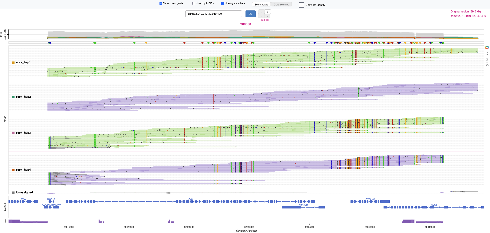

# Orographer

**Orographer is in a pre-release status for feedback only.**

## Interactive alignment plots from BAM and coordinates

Orographer reads one or more BAM files and genomic regions, then generates
interactive Bokeh-based HTML plots for reviewing long-read alignment evidence.
It supports optional GTF/GFF3 annotation tracks, VCF variant overlays,
multi-sample comparison, reference self-similarity dotplots, and specialized
Paraphase-style region views.

### Overview

Orographer can be installed from source or [Bioconda](https://bioconda.github.io/) 
and run on Mac or Linux. It requires a BAM file, reference FASTA, and coordinate(s)
in `chrom:start-end` format. Output is a single-page HTML app with JSON data,
suitable for deployment behind a simple HTTP server.

For installation and user details, see [User Guide](docs/user_guide.md).

### Region types

Orographer currently supports one release-ready region type:

- `paraphase`: whole-region phased alignment review for Paraphase-style BAMs,
  with HP/PS-aware read grouping, optional gene and VCF tracks, and detailed
  per-alignment popups. See [Paraphase Visualization Guide](docs/paraphase.md).

Plots include:

- Read alignments as arrows with orientation, haplotype, phase-set, and
  alignment-number metadata
- Optional gene annotation tracks from a bgzip-indexed GTF/GFF3 file
- Optional VCF variant tracks with clickable variant details
- Per-read mismatch, insertion, and deletion annotations when reference sequence
  is available
- Coverage tracks, including haplotype-specific coverage where available
- Coordinate navigation, cursor guide, pan/zoom controls, and a coordinate jump
  field
- Clickable alignments, labels, variants, genes, insertion markers, and
  connector evidence with details in selectable modals
- A reference self-identity dotplot, also collapsed to genomic track in the main view

### Example (paraphase data)
<h1 align="center"></h1>

### Support information
Orographer is a pre-release software intended for research use only and not for
use in diagnostic procedures. While efforts have been made to ensure that
Orographer lives up to the quality that PacBio strives for, we make no warranty
regarding this software.

As Orographer is not covered by any service level agreement or the like, please
do not contact a PacBio Field Applications Scientists or PacBio Customer Service
for assistance with any Orographer release. Please report all issues through
GitHub instead. We make no warranty that any such issue will be addressed, to
any extent or within any time frame.

### Disclaimer

THIS WEBSITE AND CONTENT AND ALL SITE-RELATED SERVICES, INCLUDING ANY DATA, ARE
PROVIDED "AS IS," WITH ALL FAULTS, WITH NO REPRESENTATIONS OR WARRANTIES OF ANY
KIND, EITHER EXPRESS OR IMPLIED, INCLUDING, BUT NOT LIMITED TO, ANY WARRANTIES
OF MERCHANTABILITY, SATISFACTORY QUALITY, NON-INFRINGEMENT OR FITNESS FOR A
PARTICULAR PURPOSE. YOU ASSUME TOTAL RESPONSIBILITY AND RISK FOR YOUR USE OF
THIS SITE, ALL SITE-RELATED SERVICES, AND ANY THIRD PARTY WEBSITES OR
APPLICATIONS. NO ORAL OR WRITTEN INFORMATION OR ADVICE SHALL CREATE A WARRANTY
OF ANY KIND. ANY REFERENCES TO SPECIFIC PRODUCTS OR SERVICES ON THE WEBSITES DO
NOT CONSTITUTE OR IMPLY A RECOMMENDATION OR ENDORSEMENT BY PACIFIC BIOSCIENCES.
