# Orographer Workflow

This diagram shows the current command and plotting flow, plus the planned
replacement for the current `complex_sv` stub described in
[`complex_sv_implementation.md`](../complex_sv_implementation.md).

```mermaid
flowchart TD
    Start([User runs orographer]) --> Command{Command}

    Command -->|deploy| DeployCLI[Parse deploy CLI arguments]
    DeployCLI --> DeployValidate[Validate output directory and port]
    DeployValidate --> StartServer[Start HTTP server]
    StartServer --> ServePlots[Serve generated HTML and JSON files]

    Command -->|plot| PlotCLI[Parse plot CLI arguments]
    PlotCLI --> CLIValidate[Validate prefix and multi-BAM argument limits]
    CLIValidate --> ParseCoords[Normalize and parse all coordinates]
    ParseCoords --> BuildLists[Build BAM, VCF, and sample-label lists]
    BuildLists --> ValidateRuntime[Validate BAM files and output directory]
    ValidateRuntime --> RegionType{region_type}

    subgraph CurrentParaphase["Current paraphase path"]
        RegionType -->|paraphase| CurrentCoordLoop[For each requested coordinate]
        CurrentCoordLoop --> CurrentRegion[Build Region with original coordinate string]
        CurrentRegion --> CurrentSampleLoop[For each BAM sample]
        CurrentSampleLoop --> ParaphaseAnnotate[Parse optional GTF/GFF3 and sample VCF]
        ParaphaseAnnotate --> ParaphaseFetch[Fetch all non-secondary alignments]
        ParaphaseFetch --> ParaphaseSegments[Build FwdStrandReadSegment objects with optional reference variants]
        ParaphaseSegments --> ParaphaseRow[Build BAM row with segments, annotations, VCF, region type, and sample label]
        ParaphaseRow --> CurrentDisplayOrder[Order rows as other BAMs above primary BAM]
        CurrentDisplayOrder --> CurrentRegionData[Append one region_data entry per requested coordinate]
    end

    subgraph CurrentComplexSV["Current complex_sv path"]
        RegionType -->|complex_sv today| StubCoordLoop[For each requested coordinate]
        StubCoordLoop --> StubRegion[Build Region with original coordinate string]
        StubRegion --> StubSampleLoop[For each BAM sample]
        StubSampleLoop --> StubAnnotate[Parse optional GTF/GFF3 and sample VCF]
        StubAnnotate --> StubFetch[Fetch only alignments with SA tags in the requested region]
        StubFetch --> StubSegments[Build render-ready split-read segments]
        StubSegments --> StubNoOp[collect_all_alignments_for_reads returns a shallow copy]
        StubNoOp --> StubRow[Build BAM row using the same current plot contract]
        StubRow --> StubDisplayOrder[Order rows as other BAMs above primary BAM]
        StubDisplayOrder --> StubRegionData[Append one region_data entry per requested coordinate]
    end

    CurrentRegionData --> PlotBuild
    StubRegionData --> PlotBuild

    subgraph PlannedComplexSV["Planned complex_sv replacement"]
        RegionType -.->|complex_sv target| SeedCollect[Parse all requested coordinates as seed intervals]:::planned
        SeedCollect -.-> ExpandSeeds[Expand seeds by 40 percent and merge into one initial frontier]:::planned
        ExpandSeeds -.-> PrimaryDiscovery[Run discovery once with the primary BAM handle]:::planned
        PrimaryDiscovery -.-> FetchSummaries[Fetch cheap alignment summaries only]:::planned
        FetchSummaries -.-> FollowSA[Follow SA-tag loci with raw-SA-string cache]:::planned
        FollowSA -.-> FrontierOps[Batch, expand, sort, merge, and subtract visited spans]:::planned
        FrontierOps -.-> MoreFrontier{More connected intervals?}:::planned
        MoreFrontier -.->|yes| FetchSummaries
        MoreFrontier -.->|no| FinalRegions[Build globally merged final visualization Regions]:::planned
        FinalRegions -.-> EmptyCoord[Use empty coordinate_str for discovered Regions]:::planned
        EmptyCoord -.-> RenderSamples[Render each BAM against the shared final regions]:::planned
        RenderSamples -.-> CombinedPass[Single pass per BAM and region]:::planned
        CombinedPass -.-> ConnectedSegments[Extract full segments only for connected reads]:::planned
        CombinedPass -.-> CoverageDiffs[Accumulate binned coverage difference arrays for all reads]:::planned
        ConnectedSegments -.-> PlannedRows[Build BAM rows with coverage_tracks and sample_index]:::planned
        CoverageDiffs -.-> CoverageTracks[Prefix-sum total and haplotype coverage tracks]:::planned
        CoverageTracks -.-> PlannedRows
        PlannedRows -.-> PlannedRegionData[Append one region_data entry per final discovered region]:::planned
    end

    PlannedRegionData -.-> PlotBuild

    subgraph BokehOutput["Current Bokeh output"]
        PlotBuild[Build Bokeh multi-region layout]
        PlotBuild --> PlotRegions[For each region_data entry]
        PlotRegions --> RowTracks[For each BAM row with segments]
        RowTracks --> VCFTrack[Create linked VCF track when variants exist]
        RowTracks --> ReadTrack[Create linked read-alignment track]
        ReadTrack --> Glyphs[Render read arrows, variants, haplotype labels, and clickable labels]
        Glyphs --> GeneAxis[Add shared gene track and genomic axis strip]
        GeneAxis --> Callbacks[Attach tap, zoom, reset, modal, and cross-region highlight callbacks]
        Callbacks --> Filename[Generate filename from region coordinate_str values]
        Filename --> SavePlot[Write Bokeh HTML and JSON payloads]
        SavePlot --> Done([Generated interactive plot])
    end

    CoverageTracks -.-> PlannedBokeh[Planned coverage figure above VCF and read tracks]:::planned
    PlannedBokeh -.-> PlotBuild

    classDef planned fill:#fff7d6,stroke:#b47d00,color:#3b2a00,stroke-dasharray:5 5;
```

## Legend

- Solid nodes show the workflow implemented by the current code.
- Dashed yellow nodes show the planned `complex_sv` and coverage-track work.
- The current `complex_sv` path is split-read-only rendering within each requested region.
- The planned `complex_sv` path runs discovery once from all seed regions, then renders shared final regions for every BAM sample.
- Planned coverage is accumulated during the rendering pass; there is no separate third coverage-only BAM scan.
